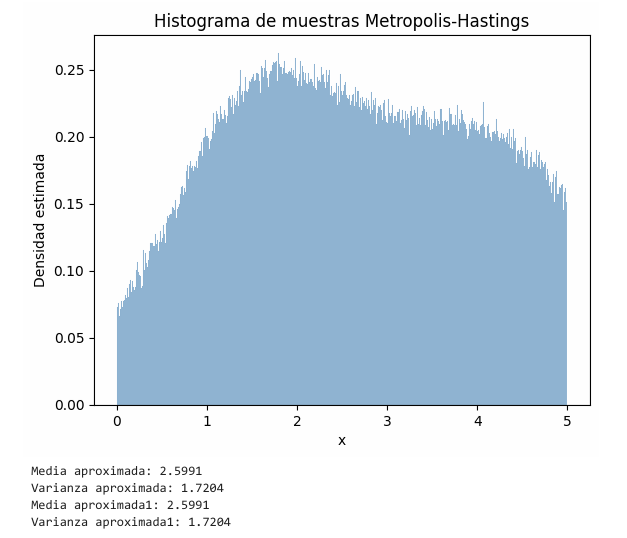
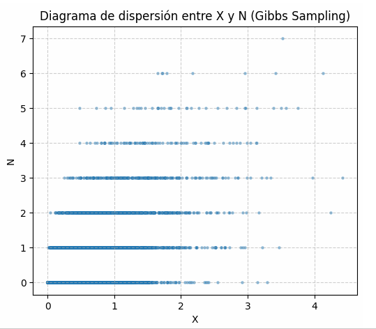

## Problema:
### Punto 1: Muestreo de Mixturas de Densidad Truncadas mediante Metropolis-Hastings

Implemente el algoritmo de Metropolis-Hastings para simular muestras de una distribución de probabilidad continua bimodal y truncada, cuya función de densidad objetivo (no normalizada) $\pi(x) \propto f(x)$ está definida en el soporte $x \in (0, 5)$ por:

$$f(x) = \exp\left(-\frac{(x - 1.5)^2}{2}\right) + \exp\left(-\frac{(x - 4)^2}{4}\right)$$

Para cualquier valor fuera de este intervalo, asuma $f(x) = 0$.
Para la ejecución del algoritmo, siga las siguientes especificaciones técnicas:

1. Condición Inicial: Configure el estado inicial de la cadena en $X_0 = 2.5$.

2. Núcleo de Transición (Kernel): Utilice una distribución propuesta basada en un paseo aleatorio gaussiano simétrico, definido como $q(x' \mid x) \sim \mathcal{N}(x, \sigma^2)$ con una desviación estándar $\sigma = 1$.

3. Estabilización de la Cadena: Genere un total de $N = 1.000.000$ de iteraciones y descarte las primeras $10.000$ muestras como periodo de calentamiento (burn-in) para mitigar el sesgo de la condición inicial.

4. Análisis Estadístico: Visualice la distribución empírica mediante un histograma de densidad estimado. Posteriormente, calcule y compare la media muestral ($\mathbb{E}[X]$) y la varianza muestral ($\text{Var}(X)$) utilizando las funciones vectorizadas de NumPy frente a una implementación explícita por acumulación de momentos mediante bucles.

## Sustentación:

- Condición de Simetría en la Aceptación:
El algoritmo de Metropolis-Hastings evalúa la probabilidad de transitar desde un estado actual $x$ hacia un estado propuesto $x'$ mediante la probabilidad de aceptación $\alpha(x, x')$, definida de manera general como:

$$\alpha(x, x') = \min\left(1, \frac{\pi(x') q(x \mid x')}{\pi(x) q(x' \mid x)}\right)$$

Dado que el kernel de transición seleccionado corresponde a una distribución normal centrada en el valor del estado inmediatamente anterior, la densidad de probabilidad de proponer $x'$ dado $x$ es:

$$q(x' \mid x) = \frac{1}{\sqrt{2\pi}\sigma} \exp\left(-\frac{(x' - x)^2}{2\sigma^2}\right)$$

Debido a que el término cuadrático es simétrico respecto a la diferencia de sus argumentos, se cumple rigurosamente que $(x' - x)^2 = (x - x')^2$, lo que implica que la probabilidad de transitar de $x$ a $x'$ es idéntica a la de transitar de $x'$ a $x$:

$$q(x' \mid x) = q(x \mid x') \implies \frac{q(x \mid x')}{q(x' \mid x)} = 1$$

Por consiguiente, el criterio de aceptación se simplifica al algoritmo de Metrópolis estándar, donde la decisión depende exclusivamente del cociente de las densidades objetivo:

$$\alpha(x, x') = \min\left(1, \frac{f(x')}{f(x)}\right)$$

- Estimación Numérica de Momentos por Acumulación:
Para validar la convergencia de la distribución estacionaria, el código contrasta los estimadores estadísticos computando la media y la varianza a partir de la muestra final de tamaño $M = T - burn\_{in}$. 

La media aproximada se fundamenta en el primer momento con respecto al origen ($\mathbb{E}[X]$):  

$$\mu_1 = \bar{X} = \frac{1}{M} \sum_{i=1}^{M} x_i$$

La varianza aproximada se deduce aplicando el teorema de traslación de momentos ($\text{Var}(X) = \mathbb{E}[X^2] - (\mathbb{E}[X])^2$), estimando de forma independiente el segundo momento con respecto al origen ($\mathbb{E}[X^2]$) mediante la función acumuladora $v(x) = x^2$:

$$\mu_2 = \frac{1}{M} \sum_{i=1}^{M} x_i^2 \implies \text{Var}(X) \approx \mu_2 - \mu_1^2$$

A continuación se muestan las imágenes de resultados obtenidos:

## Problema:
### Punto 2: Simulación de Distribuciones Condicionadas mediante Muestreo de Gibbs

Considere una distribución conjunta para las variables aleatorias $X$ (continua, donde $x > 0$) y $N$ (discreta, donde $n = 0, 1, 2, \dots$) cuya función de masa/densidad conjunta es proporcional a: 

$$f(x, n) \propto e^{-3x} \frac{x^n}{n!}$$

A partir de esta especificación, desarrolle los siguientes requerimientos:

1. Análisis Analítico: Deduzca las distribuciones condicionales completas para cada una de las variables, es decir, determine las familias paramétricas y los parámetros correspondientes para $X \mid N = n$ y $N \mid X = x$.

2. Implementación del Algoritmo: Diseñe e implemente el algoritmo de Muestreo de Gibbs (Gibbs Sampling) en Python para generar una cadena de Markov de tamaño $T = 10.000$ iteraciones. Inicialice la variable discreta en $n^{(0)} = 1$ y aplique un periodo de descarte (burn-in) para las primeras $1.000$ observaciones.

3. Inferencia Estadística: Con las muestras remanentes, realice las siguientes estimaciones empíricas:  La probabilidad de que el cuadrado de la variable continua sea menor que la variable discreta: $P(X^2 < N)$.  El valor esperado del producto de ambas variables: $\mathbb{E}[XN]$.

4. Visualización: Construya un diagrama de dispersión (scatter plot) entre $X$ y $N$ para evaluar gráficamente la estructura de dependencia e interacción entre ambas variables bajo las muestras simuladas.

## Sustentación:

1. Deducción de la Distribución Condicional $X \mid N = n$

Para hallar la distribución condicional de la variable continua $X$ dado un valor fijo de la variable discreta $N = n$, se aplica el principio del análisis bayesiano donde los términos que no dependen de la variable de interés se tratan como una constante de normalización:

$$f(X \mid N = n) \propto f(x, n) = e^{-3x} \frac{x^n}{n!}$$

Dado que $n$ es un valor conocido y fijo en esta condición, el factor $\frac{1}{n!}$ es una constante, por lo que la expresión se simplifica a:

$$f(X \mid N = n) \propto x^n e^{-3x}$$

Esta estructura matemática coincide exactamente con el núcleo de una distribución Gamma con parámetros de forma $\alpha$ y de tasa $\beta$, cuya función de densidad general es $f(y) \propto y^{\alpha - 1} e^{-\beta y}$. Comparando ambos términos, se identifican los parámetros:

$$\alpha - 1 = n \implies \alpha = n + 1$$$$\beta = 3$$

Por lo tanto, la distribución condicional para la variable continua es:

$$X \mid N = n \sim \text{Gamma}(\alpha = n + 1, \beta = 3)$$

2. Deducción de la Distribución Condicional $N \mid X = x$

De manera análoga, para determinar la distribución condicional de la variable discreta $N$ dado un valor fijo de la variable continua $X = x$, se aíslan los componentes que dependen estrictamente de $n$:

$$P(N \mid X = x) \propto f(x, n) = e^{-3x} \frac{x^n}{n!}$$

Como en este escenario $x$ se comporta como una constante, el término exponencial $e^{-3x}$ se absorbe dentro de la constante de proporcionalidad, resultando en: 

$$P(N \mid X = x) \propto \frac{x^n}{n!}$$

Esta forma funcional se equipara de manera unívoca con la función de masa de probabilidad de una distribución de Poisson, la cual se define como $P(Y = y) \propto \frac{\lambda^y}{y!}$. Al emparejar los términos, se deduce el parámetro de intensidad:

$$\lambda = x$$

En consecuencia, la distribución condicional para la variable discreta es:

$$N \mid X = x \sim \text{Poisson}(\lambda = x)$$

3. Formulación de los Estimadores de Montecarlo

Una vez que el muestreador de Gibbs alcanza su distribución estacionaria tras el burn-in, las estimaciones numéricas para una muestra de tamaño efectivo $M$ se calculan mediante los siguientes estimadores ergódicos de Montecarlo:

Para la probabilidad condicionada: Se utiliza la media muestral de una función indicadora $\mathbb{I}(\cdot)$, que toma el valor de $1$ si la condición se cumple y $0$ en caso contrario:  

$$P(X^2 < N) \approx \frac{1}{M} \sum_{i=1}^{M} \mathbb{I}(x_i^2 < n_i)$$

Para el valor esperado del producto: Se calcula el promedio aritmético directo de las realizaciones emparejadas en cada paso del muestreador:

$$\mathbb{E}[XN] \approx \frac{1}{M} \sum_{i=1}^{M} x_i n_i$$

A continuación se muestra el diagrama de dispersión obtenido:

